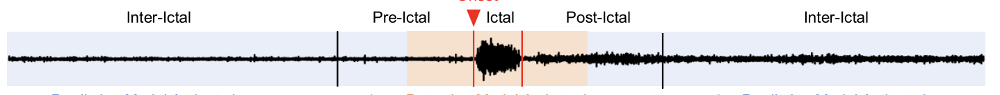
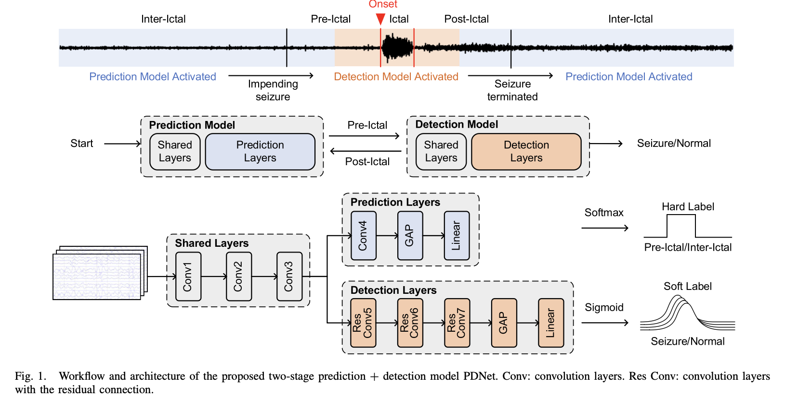

A Two Stage Prediction + Detection Framework for Real-Time Epileptic Seizure Monitoring
===

Paper Link: [A Two Stage Prediction + Detection Framework for Real-Time Epileptic Seizure Monitoring](https://ieeexplore.ieee.org/document/10950403)

### Abstract

\- Proposes a Two-Stage PDNet framework

\- Consists of lightweight seizure predictor and a highly accurate seizure detector

\- First Stage: Seizure Predictor forecasts an impending seizure

\- Second Stage: Seizure Detector is activated to precisely and rapidly classify the seizure states, thereby reducing the amount of computations.

\- Semi-Supervised Learning strategy is employed to enhance the decision bounday of the seizure predictor, which is used for electroencephalogram (EEG) preprocessing instead of prediction only.

\- PDNet is evaluated on CHB-MIT scalp EEG database.

\- Achieves 99% sensitivity, 0.43/h FAR (false alarm rate), 3.52s detection latency with 3.02 M multiply-accumulate (MAC) operations.

\- Outputs a fine-grained information such as occurance process of seizures is demonstrated by soft labels.

<!-- end_slide -->

Important Links:
===

[Brain Decode](https://braindecode.org/stable/models/models_table.html)

<!-- end_slide -->

Introduction
===

### About Epilepsy

- EPILEPSY is one of the most common neurological disorders, which is characterized by transient abnormal disturbance in brain neurons. 

- Epilepsy seizures affect approx 1% of human beings worldwide. 

- It's an unpredictable chronic disease and can lead to unconciousness at any time.

More about Epilepsy: [Epilepsy: New Advances](https://www.sciencedirect.com/science/article/pii/S0140673614604566?via%3Dihub) 

<!-- end_slide -->

Introduction
===

### How to Detect Epilepsy

- Monitoring using EEG (Electroencephalogram) signals, which spike during seizures.
- EEG Signals for epilepsy patients can be categoried into 4 states :
    - interictal (between seizures)
    - preictal (before seizures)
    - ictal (during seizure)
    - postictal (after seizure)

- EEG monitoring is either for :
    - Seizure Prediction : forcast the onset of epileptic seizures by identifying the preictal state of EEG recordings.
    - Seizure Detection : identifies ictal state of EEG recordings

<!-- end_slide -->

Introduction
===

## Important Terms for Seizure Prediction 

1. High **Sensitivity** : High sensitivity is crucial in seizure prediction because it ensures that a large proportion of actual seizures are correctly identified, allowing patients and caregivers sufficient time to take preventive measures or seek assistance.

2. Low **false alarm rate (FAR)** : , often referred to as a low false prediction rate (FPR), is equally important because frequent false alarms can lead to alarm habituation, where patients stop responding to warnings due to distrust in the system.

### Current Scenario

- The exact time of occurance cannot be predicted, which makes the prediction results less meaningful.

- Seizure predictors can only provide the probability when a seizure may occur (a few minutes or even hours later).

- Seizure Detection Algorithms can detect only ongoing seizures. 

- Seizure Detectors with high sensitivity, short detection latency, and low FAR are essentials for real-time EEG monitoring and can even eliminate the need for seizure predictors. But no such seizure detectors exist.

<!-- end_slide -->

Introduction
===

# Challenges in Seizure Detectors to achieve high sensitivity, short detection latency and low FAR simultaneously

\- Post-Processing : used by large number of seizure detectors to reduce FAR, but it introduces large latency.

\- Hard Label : Most Seizure detectors employ hard labels (0 - no seizures, 1 - seizures) but the information about 4 seizure stages (interictal, preictal, ictal and postictal states) is lost.

\- How to achieve Lightweight : Seizure proportion in a dataset is less 2% of the entire data. Some researchers adopted multi-stage classification schemes in which the first-stage is light-weight coarse classifier which detects the `suspected seizure`, then the following-stage fine classifiers would be activated to provide the final decision. This method reduces computational complexity but the cascaded coarse and fine classifiers introduce long detection latency.

<!-- end_slide -->

Introduction
===

## Main Contributions of this Paper

\- A lightweight predictor with temporal ensembling in the proposed model is used for preprocessing instead of prediction only, to achieve low FAR and short detection latency, thereby avoiding the pitfalls in the traditional postprocessing methods.

\- Adopted soft labels [circular smooth labels (CSLs)] to represent the seizure states.

\- Activating the highly accurate seizure detector in the proposed model occassionally, which reduces the overall computational complexity of the model.

<!-- end_slide -->

Methodology
===

\- Two stage PDNet model : prediction model + detection model

\- Prediction model is used for the purpose of pre-processing instead of pure prediction and works together with the detection model to detect the occurence of seizures.

\- To improve the decision boundary between the preictal and interictal states, the model is trained by a semi-supervised learning method.

\- To precisely and rapidly classify the seizure states, the seizure detector is trained with soft labels.

Methodology is divided into 4 sections : 
- Two-Stage Prediction + Detection Model
- Consistency-Based Semisupervised Seizure Prediction
- Seizure Detection Model with Soft Labels
- Training Methodology

<!-- end_slide -->

A. Two Stage Prediction + Detection model
===

## Overview

Only when the first stage seizure predictor forecasts an impending seizure, the second-stage seizer detector is enabled to classify the seizure states. When the seizure terminates, the seizure detector is turned off and the seizure predictor is enabled to predict the next seizure.

3 key points which helped in achieving `high detection accuracy`, `low FAR`, `short detection latency`

\- The seizure predictor with postprocessing is used for preprocessing of the seizure detection stage to reduce FAR, thereby avoiding the long detection latency introduced by postprocessing after seizure detection.

\- Soft Labels are employed to facilitate the proposed seizure monitor to precisely recognise the stages of seizure, thereby achieving highly accurate classification.

\- Due to the low occurance rate of seizures, the lightweight predictor dominates the runtime of the seizure monitoring framework, while the high accuracy detector only works when necessary. Therefore, PDNet framework achieves overall lightweight seizure monitoring, which is critical for the deployment of wearable edge devices.

<!-- end_slide -->

A. Two Stage Prediction + Detection Model
===

## Model Architecure

<!-- end_slide -->

A. Two Stage Prediction + Detection Model
===

### Technicalities

\- 1-D Convolution is used, which can automatically learn features from raw EEG data with less computation and paramters compared with 2D or 3D convolutions.

\- Leaky Rectified Linear Unity (LeakyReLU) is employed as activation function for all the convolution layers.

\- Following the Convolution layer, a Global Average Pooling (GAP) layer is used to shrink the activation maps for the linear layer. 

\- The probability output of a prediction is generated by a softmax layer.

\- The soft output for the detection model is generated by a sigmoid layer.

<!-- end_slide -->

B. Consistency-Based Semi-Supervised Seizure Prediction Model
===

\- The boundary between the preictal and the interictal states is uncertain. Setting a boundary and dividing the samples into preictal or interictal states arbitrarily leads to mislabeled samples which greately degrades the classification accuracy.

\- Rather than discarding the eeg samples between the interictal and preictal states to avoid disinformation, we retain the EEG samples between the preictal and interictal states as unlabeled samples and use semi-supervised learning with `Consistency Regularization` to train the prediction model.

### [Consistency Regularization](https://arxiv.org/abs/1910.13188)

- Discriminative features can be learned from unlabeled data. 

- The inputs of models are pertubed by stochastic augmentation in each epoch.

- Consistency Regularization allows the model to maintain consistent results for similar samples with minor variations.

-  Decision boundary is pushed to the low-density regions of the feature space as similar samples gather.

### [Temporal Ensembling for Semi-Supervised Learning](https://arxiv.org/abs/1610.02242)
- Temporal ensembling can provide resistance to disinformation and maintain a good performance even when a large portion of samples are mislabeled. 

<!-- end_slide -->

B. Consistency-Based Semi-Supervised Seizure Prediction Model
===

## Technicalities : 

\- Adopted `Temporal Ensembling` method as consistency regularization to further improve the decision boundary and enhance the tolerance to 'incorrect labels' between the preictal and interictal states.

\- Interictal period is defined as between atleast 2 hr before seizure onset and 2 hr after seizure end.

\- 

